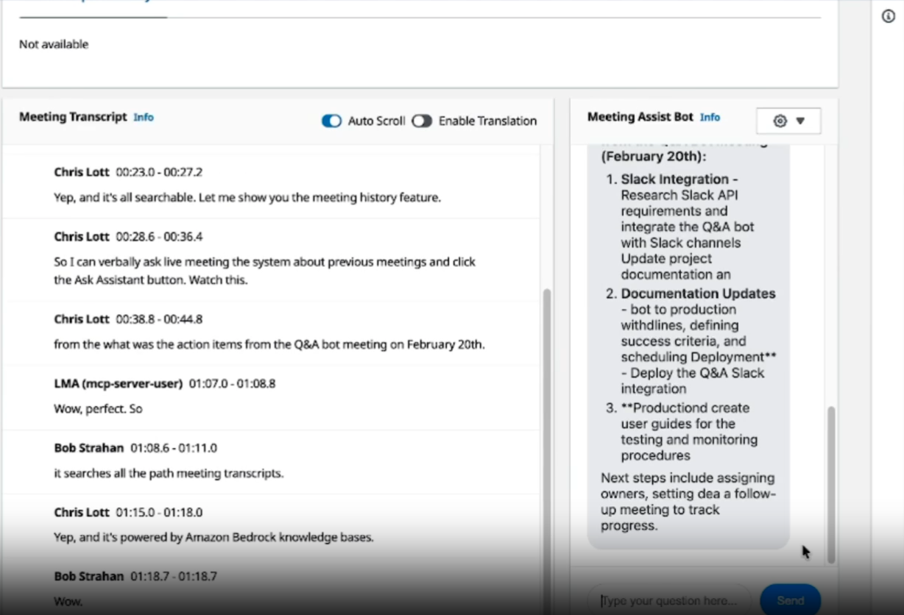

# Amazon Transcribe Live Meeting Assistant


Transform your virtual meetings with real-time transcription and AI-powered insights using Amazon Transcribe. Designed for remote teams, enterprise professionals, and educators who need flawless meeting documentation, it reduces meeting wrap-up time by up to 80% through instant summaries and action items.



## ✨ Key Features

- **Capture real-time meeting dialogue** with sub-second latency via Amazon Transcribe's streaming capabilities.
- **Deploy seamlessly via browser extension** to support Google Meet, Zoom, and Microsoft Teams without bot participants.
- **Secure meeting data strictly** with multi-tenant row-level security (RLS) powered by Supabase.
- **Automate meeting summaries and action items** with the integrated AI stack connected directly to transcripts.
- **Scale effortlessly to thousands of users** with serverless AWS CloudFormation stacks for WebSockets and Virtual Participants.
- **Analyze transcripts instantly** using the real-time analytics dashboard to track participant speaking time and sentiment.

## 🚀 Quick Start

Get the Live Meeting Assistant up and running locally in under 5 minutes.

```bash
# 1. Clone the repository
git clone https://github.com/quangkmhd/amazon-transcribe-live-meeting-assistant.git
cd amazon-transcribe-live-meeting-assistant

# 2. Install dependencies
npm install

# 3. Start the local WebSocket transcriber server
npm run start:websocket

# 4. Open the browser extension in your Chromium browser
# Navigate to chrome://extensions, enable Developer Mode, and load the unpacked extension from /lma-browser-extension-stack.
```

**Expected Output:** The WebSocket server will start on `localhost:8080`, and the browser extension icon will light up. When you join a web meeting, you will see live transcriptions flowing into the extension popup.

## 📦 Installation

Choose the installation method that best fits your environment.

### Method 1: AWS CDK (Recommended for Production)

Deploy the entire infrastructure directly to your AWS account.

```bash
# Navigate to the setup stack
cd lma-meetingassist-setup-stack

# Install AWS CDK dependencies
npm install -g aws-cdk
npm install

# Bootstrap and deploy the stacks
cdk bootstrap aws://YOUR_ACCOUNT_ID/YOUR_REGION
cdk deploy --all --require-approval never
```

### Method 2: Local Development Setup

For testing UI changes and Supabase integrations locally.

```bash
# Start local Supabase instance
cd supabase
supabase start

# Install main project dependencies
cd ..
npm install

# Run the Playwright test suite to verify the environment
npm run test
```

## 💻 Usage Examples

### Example 1: Starting a Live Transcription Session

When the browser extension is loaded, it automatically detects meeting platforms. Here is how it initiates transcription via WebSockets.

**Problem:** You need to capture audio from the browser tab and send it to Amazon Transcribe securely.

```javascript
// Example from the browser extension background script
const socket = new WebSocket('wss://your-api-gateway-url/stream');

socket.onopen = () => {
  console.log('Connected to LMA Transcriber');
  // Send initial meeting metadata
  socket.send(JSON.stringify({ 
    action: 'start_session', 
    meetingId: 'meet-12345',
    tenantId: 'tenant-xyz' 
  }));
};

// Stream audio buffers
navigator.mediaDevices.getUserMedia({ audio: true }).then(stream => {
  const mediaRecorder = new MediaRecorder(stream);
  mediaRecorder.ondataavailable = (event) => {
    if (event.data.size > 0 && socket.readyState === WebSocket.OPEN) {
      socket.send(event.data);
    }
  };
  mediaRecorder.start(100); // 100ms chunks
});
```
*Concept: The extension captures system audio and streams it in 100ms binary chunks to the AWS WebSocket stack, ensuring ultra-low latency transcription.*

### Example 2: Querying Meeting Summaries

After a meeting concludes, the AI stack processes the transcript.

**Problem:** You need to fetch the generated summary and action items for a completed meeting.

```javascript
// Fetch meeting summary using Supabase client
import { createClient } from '@supabase/supabase-js'

const supabase = createClient('https://xyzcompany.supabase.co', 'public-anon-key')

async function getMeetingSummary(meetingId) {
  const { data, error } = await supabase
    .from('meeting_summaries')
    .select('summary_text, action_items')
    .eq('meeting_id', meetingId)
    .single();

  if (error) throw error;
  return data;
}

getMeetingSummary('meet-12345').then(console.log);
```
**Expected Output:**
```json
{
  "summary_text": "The team discussed the Q3 roadmap...",
  "action_items": ["Sarah to finalize UI mockups", "John to provision DB"]
}
```
*Concept: The AI stack listens to S3 bucket events where transcripts are saved, generates summaries, and writes them back to Supabase.*

### Example 3: Verifying Multi-Tenant Isolation (RLS)

Ensure that users from one organization cannot access meetings from another.

**Problem:** Testing Supabase Row Level Security locally.

```bash
# Run the specific RLS testing script
npm run test:rls
```

```javascript
// scripts/test-rls-isolation.js
// Simulating an unauthorized access attempt
const { data, error } = await supabase
    .from('transcripts')
    .select('*')
    .eq('tenant_id', 'other-tenant-id');

console.assert(data.length === 0, "RLS Failed! Data leaked.");
```
*Concept: Supabase RLS policies are applied at the database level, ensuring strict data isolation regardless of the API endpoint used.*

## 🔧 Troubleshooting

- **WebSocket Connection Refused (403):**
  - *Cause:* Invalid IAM credentials or expired temporary tokens.
  - *Solution:* Ensure your `aws configure` profile is valid and the API Gateway has the correct IAM authorizer attached.
- **Audio not transcribing (Silent failures):**
  - *Cause:* The browser extension lacks microphone/tab capture permissions.
  - *Solution:* Click the extension icon and explicitly grant audio capture permissions.
- **Playwright tests failing on `test:ui`:**
  - *Cause:* Missing browser binaries.
  - *Solution:* Run `npx playwright install` to download required Chromium/WebKit binaries.

## 📚 Documentation Links

- **[System Architecture](./docs/ARCHITECTURE.md)**  
  Dive into the core infrastructure powering the live transcription pipeline. This guide reveals the seamless data flow from browser WebSockets to AWS serverless components and Supabase RLS, showcasing how the app scales to handle massive concurrency without breaking a sweat.

- **[API Reference](./docs/API_REFERENCE.md)**  
  Explore the exhaustive API endpoints and payload structures used by the meeting assistant. Whether you're building custom integrations or debugging AI summary responses, this documentation provides the exact JSON schemas and authentication methods you need.

- **[Configuration Guide](./docs/CONFIGURATION.md)**  
  Unlock the full potential of your deployment by tuning environment variables and AWS CDK stack parameters. Discover how to effortlessly switch LLM providers, adjust WebSocket timeouts, and lock down your multi-tenant security rules for a production-ready setup.

## 🤝 Contributing

We welcome contributions from the community! To get started:

1. Fork the repository.
2. Create a new branch (`git checkout -b feature/amazing-feature`).
3. Make your changes and ensure tests pass (`npm run test`).
4. Commit your changes (`git commit -m 'Add amazing feature'`).
5. Push to the branch (`git push origin feature/amazing-feature`).
6. Open a Pull Request.

Please review our [Contributing Guidelines](CONTRIBUTING.md) for more details on our code of conduct and development process.

## 📄 License

This project is licensed under the MIT License - see the [LICENSE](LICENSE) file for details.

## 🙏 Credits

- Built with [Amazon Transcribe](https://aws.amazon.com/transcribe/).
- Powered by [Supabase](https://supabase.com/).
- Tested with [Playwright](https://playwright.dev/).
